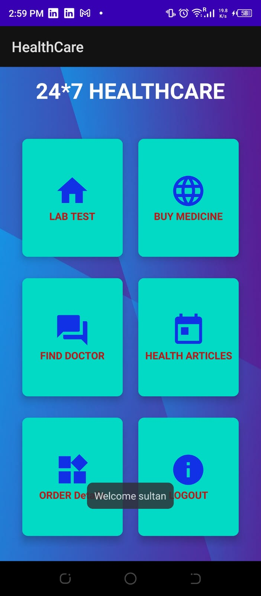

# healthCare
The Health Care App is an Android application developed using Android Studio that aims to provide users with a comprehensive platform for managing their healthcare needs. The app allows users to find doctors, access health articles, schedule lab tests, and purchase medicines, all within a single, user-friendly interface.

Features
Find Doctors: Easily search for doctors based on specialty, location, availability, and user ratings. View detailed profiles of doctors, including their qualifications, experience, and patient reviews.

Health Articles: Access a rich collection of health articles and medical resources on various topics. Stay informed about health trends, tips, and latest medical advancements.

Lab Test Scheduling: Conveniently schedule lab tests and screenings at preferred diagnostic centers. Choose from a range of available tests, select a suitable time slot, and receive reminders.

Medicine Purchase: Order prescribed medicines through the app from partnered pharmacies. Browse a wide range of medicines, add them to your cart, and have them delivered to your doorstep.

Installation
Follow these steps to get the Health Care App up and running on your Android device:

Clone the repository:

bash
Copy code
git clone https://github.com/your-username/health-care-app.git
Open the project in Android Studio.

Build and run the app on your Android device or emulator.

Screenshots
  
